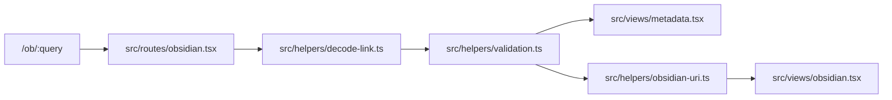

# Abstraction Boundaries

Apply these rules to verify that new code respects the project's separation of concerns.

## Routes vs Helpers

Route files should orchestrate Hono request handling and metadata while pure helpers own reusable bridge logic. This keeps payload parsing, validation, URI building, and bot detection testable outside route rendering.

**Guidelines:**

- MUST keep reusable parsing, validation, URL building, and user-agent detection in `src/helpers/**`.
- MUST keep route registration and request branching under `src/routes/**`.
- MUST keep Hono JSX view markup and document metadata helpers under `src/views/**`.
- SHOULD keep `src/routes/obsidian.tsx` as orchestration glue over helpers and views, not the place where base64, schema, or URI logic is reimplemented.
- MUST NOT duplicate `BridgePayload` validation in routes or views; use `validateBridgePayload()` or `decodeBridgeQuerySafe()`.

## Server vs Browser Boundaries

Hono renders HTML on the server. Browser-only behavior, such as custom-protocol launch attempts, must stay in small client script snippets and receive already-built strings through escaped attributes.

**Guidelines:**

- MUST keep `window.location`, `document`, custom-protocol launch attempts, and other browser APIs inside narrow client script snippets.
- MUST keep `process.env`, `Buffer`, validation helpers, and decoded payload objects out of browser script snippets.
- SHOULD keep launch snippets narrow enough to review without also reviewing route metadata or validation logic.

## Validation and URL Construction

Bridge payloads and URLs have one canonical construction path. Duplicating that logic makes metadata, tests, and client launch behavior drift.

**Guidelines:**

- MUST use `buildObsidianUri()` for `obsidian://open` links.
- MUST use `buildBridgeUrl()` for public HTTPS proxy links.
- MUST keep field limits in `src/helpers/validation.ts` rather than scattering constants across routes, views, and tests.
- SHOULD add tests beside any helper behavior change before changing route code that depends on it.

## Imports

Imports should use the simplest path that preserves Node ESM compatibility after TypeScript emit.

**Guidelines:**

- SHOULD use short relative imports inside `src/**`.
- MUST include explicit `.js` extensions for relative TypeScript imports that emit to Node ESM.
- MUST NOT invent aliases that are not configured in `tsconfig.json`.
- SHOULD avoid deep relative imports that cross several directories when a small module boundary would be clearer.
