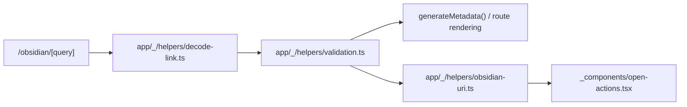

# Abstraction Boundaries

Apply these rules to verify that new code respects the project's separation of concerns.

## Routes vs Helpers

Route files should orchestrate rendering and metadata while pure helpers own reusable bridge logic. This keeps payload parsing, validation, URI building, and bot detection testable outside App Router.

**Guidelines:**

- MUST keep reusable parsing, validation, URL building, and user-agent detection in `app/_/helpers/**`.
- MUST keep route rendering, metadata generation, and route-specific invalid-link UI under `app/**`.
- SHOULD keep `app/obsidian/[query]/page.tsx` as orchestration glue over helpers, not the place where base64, schema, or URI logic is reimplemented.
- MUST NOT duplicate `BridgePayload` validation in route components; use `validateBridgePayload()` or `decodeBridgeQuerySafe()`.

## Server vs Client Components

Server components can read route inputs, environment, metadata, and Node-backed helpers; client components can touch `window` and attempt custom-protocol launches. Crossing that boundary accidentally creates build or runtime failures.

**Guidelines:**

- MUST keep `window.location`, custom-protocol launch attempts, and other browser APIs inside `"use client"` components.
- MUST keep `next/headers`, metadata generation, `process.env`, and Node APIs such as `Buffer` out of client components.
- SHOULD keep client components narrow. `_components/open-actions.tsx` should own launch behavior, not payload decoding or metadata.

## Validation and URL Construction

Bridge payloads and URLs have one canonical construction path. Duplicating that logic makes metadata, tests, and client launch behavior drift.

**Guidelines:**

- MUST use `buildObsidianUri()` for `obsidian://open` links.
- MUST use `buildBridgeUrl()` for public HTTPS bridge links.
- MUST keep field limits in `app/_/helpers/validation.ts` rather than scattering constants across routes and tests.
- SHOULD add tests beside any helper behavior change before changing route code that depends on it.

## Imports

Imports should communicate ownership without hiding dependencies. Route code can use the configured alias for helper access; helper code should stay simple and local.

**Guidelines:**

- SHOULD use `@/helpers/...` from route files.
- SHOULD use short relative imports inside `app/_/helpers/**`.
- MUST NOT invent aliases that are not configured in `tsconfig.json`.
- SHOULD avoid deep relative imports that cross several directories when `@/*` is clearer.
